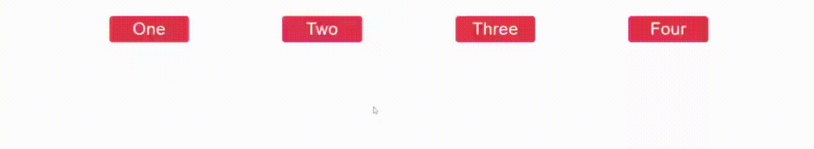

# @ramonak/react-button-group

> React ButtonGroup component with the selection (active button) functionality

[](https://www.npmjs.com/package/@ramonak/react-button-group) [](https://standardjs.com)

---



---

## Install

```bash
npm install --save @ramonak/react-button-group
```

## Usage

```jsx
import React from 'react'
import ButtonGroup from '@ramonak/react-button-group'

const Example = () => {
  return <ButtonGroup buttons={['One', 'Two', 'Three', 'Four']} />
}
```

## Props

| Name | Type | Default | Description |
| ---- | ---- | ------- | ----------- |
| `buttons` (required) | `Array of strings` |  | Labels of buttons. For buttons without labels pass an array with empty strings. |
| `orientation` | `string:` <br/>`horizontal, vertical` | `horizontal` | Orientation of button group: vertical or horizontal display |
| `containerClassName` | `string` |  | Class name for custom styles of a wrapper *div* |
| `buttonClassName` | `string` |  | Class name for custom styles of a button inside a button group |
| `activeButtonClassName` | `string` |  | Class name for custom styles of an active (selected) button inside a button group |

## License

MIT © [KaterinaLupacheva](https://github.com/KaterinaLupacheva)
